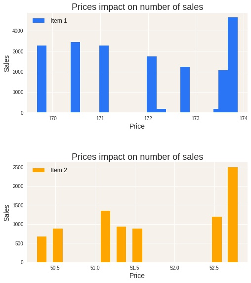

# Sales Prediction 

By **Paula Pipkin** 

### The business is trying to predict sales:

Based on features of the items being sold and some relevant features of the stores selling those items, we will try to predict future sales.

### Data:

The data set source is the website Analytics Vidhya and here is a link to the original data:
https://datahack.analyticsvidhya.com/contest/practice-problem-big-mart-sales-iii/

## Methods

- After some pre cleaning, two copies of the data were made so EDA could be done without risking leakage.  
- EDA was used to show correlations between some relevant features
- Three models were applied, Linear Regression, Decision Tree and Random Forrest

## Results

#### Heat Map for numerical Features
.jpg)

> The best correlation with the target is with Max retail price.

#### Sales of 2 different items and their respectives prices

> Even though MRP has the best correlation to Sales, it still does not explain why for the items above the sales do not vary according to the different prices.

#### Showing metrics for testing data:

| Model         | RMSE                   | R2       |
| ------------- | -----------------------| -------- |
| Linear Regression | 35849625523401.445312	 | -465823207696583688192.0 |
| Decision Tree | 1464.4947              | 0.5886  |
| Random Forrest|1101.6168	|0.5988	

## Recommendations, Limitations & Next Steps:

- *With a negative R2 score, you can safely assume that the model is a very poor fit to the data and a super large RMSE will only confirm that.
So based on the metrics results I wouldn't suggest a linear regression model to this data.* 

- *The Decision Tree and the Random Forrest yielded better metrics values, it is far from perfect, specially if we anallize the RMSE that is showing great difference between training and test data. But the R2 is around 60%, which indicates that more relevant features should be add to the data if we want to predict the sales with confidence, still, the model can at this point explain 60% of the variance on the results and among the 3 I would recomend Decision Tree over Linear Regression and since 'Item Identifier' was dropped for the process of the Random Forrest, I will follow up with the Decision Tree, because this model consider more features that I find relevant*  

### For further information

For any additional questions, please contact **paulareche@gmail.com**
